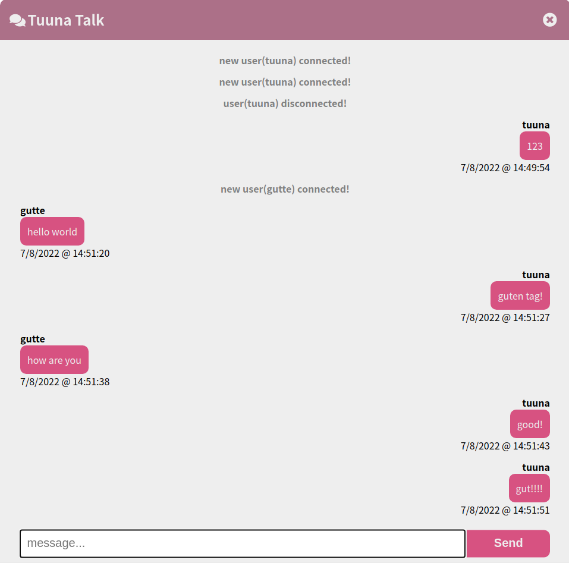

# TuunaTalk
 
### frontend 
1. html, css, vanilla javascript, socket.io 

### backend 
1. node.js - express framework, socket.io 

### Logic 
socket.io를 이용한 간단한 채팅앱
express-session을 이용하여 세션을 획득한 사용자만 chat app(socket.io)을 이용할 수 있도록 제작 

### Usage 
node index.js 

### Todo 
[] 새로고침을 진행해도 대화내용 백업 및 복구 진행 
[] 새로고침을 했을 때 새로운 유저로 인식하지 않기 
[] 동일한 세션ID의 경우 바로 대화내용 복구하기 및 새로운 유저로 인식하지 않기

# Image

